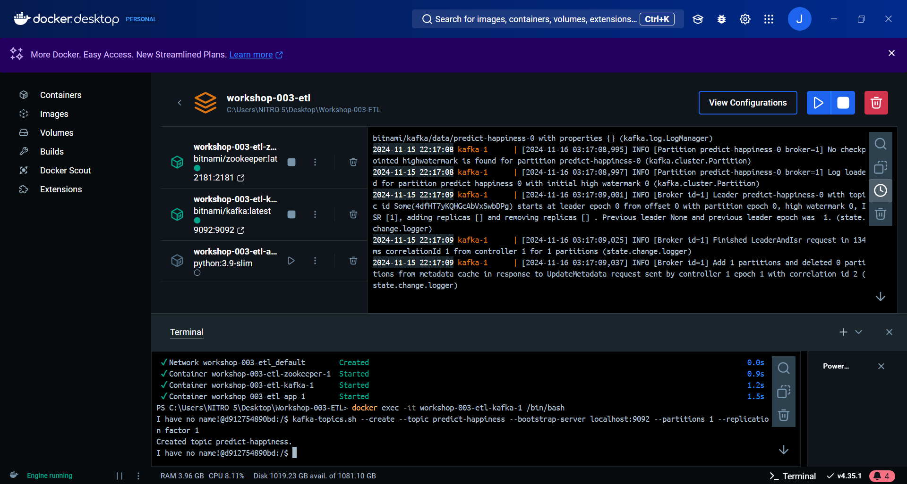

# Happiness Index Prediction Analysis 🌍😊
This project aims to predict the happiness index of different countries using a Support Vector Regression (SVR) model. The data used for this analysis includes economic, health, and social indicators from several countries. The workflow involves data loading, model training, feature scaling, hyperparameter optimization, and integration with Kafka for sending and receiving predictions.
---

## 📦 Technologies Used
- Python 🐍
- Scikit-learn 📊
- Kafka ☕
- PostgreSQL 🗄️
- Pandas 📑
- Joblib 📦
- dotenv 🌱
- Docker Compose 🐳

---

## 🛠️ Workflow

Data Loading and Preparation 📥

Data was loaded from the happiness_dataset.csv dataset.
Unnecessary columns, such as the happiness_score column (the target variable), were removed.
Prediction Model 📈

A SVR (Support Vector Regression) model was trained using country features as inputs.
The model was optimized using Cross-Validation and Hyperparameter Tuning through advanced techniques like Grid Search and Randomized Search.
The model and feature scaler were exported as .pkl files for later use.
Kafka for Sending and Receiving Data 📨

Kafka was configured to send input feature data from a producer (message production) to a consumer (message consumption).
Producer (KafkaProducer):

The producer reads data from the CSV file and sends it as JSON messages to a Kafka topic called predict-happiness.
Consumer (KafkaConsumer):

The consumer listens to the predict-happiness topic and, once a message is received, processes the features, scales them using the exported scaler, and makes predictions using the trained model.
The prediction results (happiness index) are inserted into a PostgreSQL database.
Exporting the Model and Scaler 💾

Model: The SVR model was trained and exported to a .pkl file.
Scaler: The scaler used to normalize features before making predictions was trained and exported.
PostgreSQL Database 🗄️

A PostgreSQL database was set up to store happiness predictions along with the features of each country.
---


## ⚙️ Steps to Run the Project
Install Dependencies 🔧 Ensure you have Python 3.8 or higher and the following libraries installed:

```
pip install -r requirements.txt
```
Set Up the Environment 🌍 Create a .env file with your database credentials:

```
DB_NAME=your_database_name
DB_USER=your_user
DB_PASSWORD=your_password
DB_HOST=localhost
```

Start the Kafka Container with Docker Compose 🐳

To start the Kafka and Zookeeper containers, use the following command:

```
docker-compose up --build -d
```
- 


Access the Kafka Container 🖥️ Once the Kafka container is up, access it to create topics and manage configurations:

```
docker exec -it workshop-003-etl-kafka-1 /bin/bash
```

Create the Kafka Topic 📝 Inside the Kafka container, create the topic where data will be sent with this command:

```
kafka-topics.sh --create --topic predict-happiness --bootstrap-server localhost:9092 --partitions 1 --replication-factor 1
```
- 


Run the Kafka Producer 📤 The producer will send data to the Kafka server:

```
python producer.py
```

Run the Kafka Consumer 📥 The consumer will listen to Kafka messages, make predictions, and insert them into the database:

```
python consumer.py
```
- 

Before:

- 

After:

- 

If you would like to see how the data was sent in video, [click here](https://drive.google.com/file/d/1xyCnR6LVnxWSuozdgLueU7MPZJXUkunA/view?usp=sharing)


## 🚀 Model Improvements
Feature Scaling: StandardScaler was used to normalize the data before passing it to the model.
Hyperparameter Optimization: Hyperparameters were tuned using Grid Search and Randomized Search to improve model accuracy.
Standardization: Standardization was applied to ensure the features had comparable scales.

## 🎯 Results
The final model achieved an R² of 83.21%, meaning that the happiness index predictions were quite accurate. Performance was evaluated through cross-validation, and advanced techniques were used to optimize the model’s hyperparameters.

## 🔄 Model and Scaler Export
Both the model and the scaler were successfully exported as .pkl files for later use in a production environment.

## 📝 Conclusion
This project demonstrates how to combine machine learning techniques, Kafka, and databases to create an efficient and scalable workflow for predicting indices, in this case, the world happiness index. The optimizations made to the model ensure that the predictions are as accurate as possible.

Thanks for checking out this project! 😊

